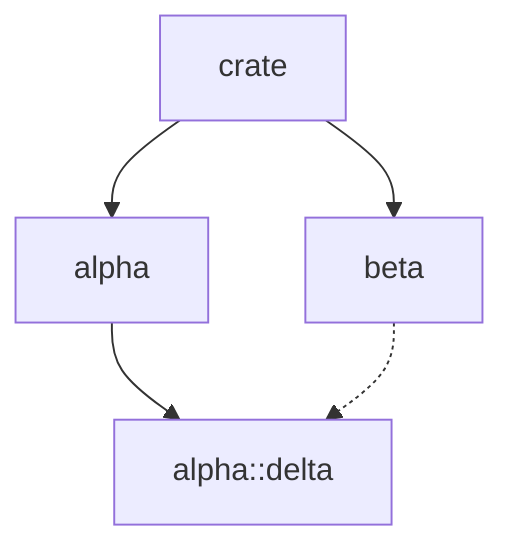

# dgmod

A command-line tool that analyzes Rust crates and generates Mermaid diagrams of module dependencies.

## Installation

```sh
cargo install --path dgmod
```

Or run directly from the workspace:

```sh
cargo run -p dgmod -- /path/to/crate
```

## Usage

```sh
dgmod [OPTIONS] [PATH]
```

### Arguments

- `PATH` — Path to the Rust crate or workspace to analyze (default: current directory)

### Options

- `--exclude-tests` — Exclude `tests` modules from the output

### Examples

```sh
# Analyze current directory
dgmod

# Analyze a specific crate
dgmod /path/to/my-crate

# Save output to a file
dgmod /path/to/my-crate > deps.md

# Exclude test modules
dgmod --exclude-tests
```

## Example

Given a crate with this structure:

```
src/
├── lib.rs       # pub mod alpha; pub mod beta;
├── alpha/
│   ├── mod.rs   # pub mod delta;
│   └── delta.rs
└── beta.rs      # use crate::alpha::delta;
```

Running `dgmod` produces:

~~~
## my-crate


~~~

Which renders as:


### Edge Types

- **Solid arrows** (`-->`) — `mod` declarations (parent declares child module)
- **Dashed arrows** (`-.->`) — `use` imports (module imports from another)

## Workspace Support

When pointed at a Cargo workspace, dgmod generates a separate diagram for each member crate.
