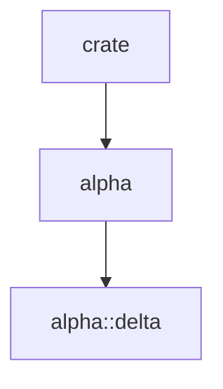

# Research: dgmod (Rust Module Dependency Graph)

**Date**: 2025-12-20
**Branch**: `001-dgmod`

## Overview

This document consolidates research findings for implementing the dgmod tool, which analyzes Rust source code to generate module dependency graphs in Mermaid format.

---

## 1. Rust Source Parsing with `syn`

### Decision
Use `syn` crate with `parse_file()` function for parsing Rust source files.

### Rationale
- `syn::parse_file()` is the standard approach for parsing complete Rust source files
- Returns `syn::File` containing all top-level items (modules, use statements, etc.)
- Industry standard: used by rust-analyzer, cargo-expand, and many linters
- Well-maintained with good documentation

### Alternatives Considered
- **Manual parsing**: Rejected - error-prone, doesn't handle full Rust grammar
- **tree-sitter-rust**: Rejected - more complex, syn is Rust-native and more idiomatic
- **rustc internals**: Rejected - unstable, heavy dependency

### Key Implementation Patterns

**Cargo.toml configuration:**
```toml
[dependencies]
syn = { version = "2.0", features = ["full", "extra-traits"] }
```
- `"full"`: Required for parsing all syntax tree types
- `"extra-traits"`: Adds Debug, Eq, Hash for testing

**Parsing a file:**
```rust
fn parse_rust_file(path: &Path) -> Result<syn::File, ParseError> {
    let content = fs::read_to_string(path)?;
    syn::parse_file(&content).map_err(|e| ParseError::Syntax { path, error: e })
}
```

**Extracting mod and use declarations:**
```rust
for item in &file.items {
    match item {
        Item::Mod(item_mod) => { /* process module */ }
        Item::Use(item_use) => { /* process use statement */ }
        _ => {}
    }
}
```

**Handling `#[path = "..."]` attribute:**
```rust
fn get_path_attribute(item_mod: &ItemMod) -> Option<String> {
    for attr in &item_mod.attrs {
        if attr.path().is_ident("path") {
            if let Meta::NameValue(nv) = &attr.meta {
                if let Expr::Lit(ExprLit { lit: Lit::Str(s), .. }) = &nv.value {
                    return Some(s.value());
                }
            }
        }
    }
    None
}
```

**Distinguishing inline vs external modules:**
- `ItemMod.content == Some((_, items))`: Inline module with body
- `ItemMod.content == None`: External module (`mod foo;` declaration)

---

## 2. Cargo Workspace Detection with `cargo_metadata`

### Decision
Use `cargo_metadata` crate for workspace detection and member enumeration.

### Rationale
- Official, well-maintained crate for querying Cargo metadata
- Handles complex workspace configurations correctly
- Provides uniform interface for single crates and workspaces
- Faster than parsing Cargo.toml manually

### Alternatives Considered
- **Manual TOML parsing**: Rejected - doesn't handle workspace inheritance, virtual workspaces
- **Reading Cargo.lock**: Rejected - doesn't provide workspace structure

### Key Implementation Patterns

**Cargo.toml configuration:**
```toml
[dependencies]
cargo_metadata = "0.18"
```

**Loading metadata:**
```rust
use cargo_metadata::MetadataCommand;

fn load_metadata(path: &Path) -> Result<Metadata, Error> {
    let manifest = path.join("Cargo.toml");
    MetadataCommand::new()
        .manifest_path(&manifest)
        .no_deps()  // Faster: skip dependency resolution
        .exec()
        .map_err(Error::from)
}
```

**Detecting workspace vs single crate:**
```rust
fn is_workspace(metadata: &Metadata) -> bool {
    metadata.workspace_members.len() > 1
}
```

**Getting workspace members:**
```rust
fn get_crate_roots(metadata: &Metadata) -> Vec<(String, PathBuf)> {
    metadata.workspace_members
        .iter()
        .filter_map(|id| metadata.packages.iter().find(|p| &p.id == id))
        .map(|pkg| (
            pkg.name.clone(),
            pkg.manifest_path.parent().unwrap().into()
        ))
        .collect()
}
```

**Error handling:**
- `MetadataError::CargoMetadata { stderr }`: Contains cargo's error message
- `MetadataError::Io`: File system errors
- Search upwards for Cargo.toml if not found at initial path

---

## 3. Mermaid Output Format

### Decision
Output Mermaid flowchart syntax with sanitized node IDs and display labels.

### Rationale
- Native support in GitHub/GitLab markdown
- Compatible with Mermaid CLI (`mmdc`)
- Can be pasted directly into Notion
- Human-readable text format

### Alternatives Considered
- **DOT/Graphviz**: Rejected - requires separate tool installation
- **JSON**: Rejected - not directly renderable
- **ASCII art**: Rejected - poor readability for complex graphs

### Key Implementation Patterns

**Basic structure:**


**Handling special characters (`::`)**
- Node IDs must not contain `::` - replace with `_`
- Display labels in brackets preserve original path: `["alpha::delta"]`

**Generation pattern:**
```rust
fn sanitize_id(path: &str) -> String {
    path.replace("::", "_")
}

fn emit_node(path: &str) {
    let id = sanitize_id(path);
    println!("    {}[\"{}\"]", id, path);
}

fn emit_edge(from: &str, to: &str) {
    println!("    {} --> {}", sanitize_id(from), sanitize_id(to));
}
```

**For workspaces (multiple graphs):**
```rust
fn emit_crate_graph(name: &str, edges: &[(String, String)]) {
    println!("## {}\n", name);
    println!("```mermaid");
    println!("flowchart TD");
    // ... nodes and edges
    println!("```\n");
}
```

**Performance for large graphs (100+ nodes):**
- Use `flowchart` (newer, better performance than `graph`)
- Consider subgraphs for organization if needed
- Keep edge count reasonable (<500) for browser rendering

---

## 4. Module Resolution Strategy

### Decision
Implement standard Rust 2018/2021 module resolution with #[path] override support.

### Rationale
- Must match rustc behavior for accurate graphs
- Spec requires FR-014: Handle #[path] attribute

### Resolution Algorithm

1. Check for `#[path = "..."]` attribute → use specified path
2. For `mod foo;` without #[path]:
   - Try `{parent}/foo.rs`
   - Try `{parent}/foo/mod.rs`
3. For inline modules (`mod foo { ... }`): no file resolution needed

```rust
fn resolve_module_path(parent_dir: &Path, mod_name: &str, item: &ItemMod) -> PathBuf {
    if let Some(custom) = get_path_attribute(item) {
        return parent_dir.join(custom);
    }

    let direct = parent_dir.join(format!("{}.rs", mod_name));
    if direct.exists() {
        direct
    } else {
        parent_dir.join(mod_name).join("mod.rs")
    }
}
```

---

## 5. Use Statement Analysis

### Decision
Walk `UseTree` recursively to extract all import paths, filtering external crates.

### Key Patterns

**UseTree variants:**
- `UsePath`: Path segment (e.g., `crate::` in `use crate::foo`)
- `UseName`: Final name (e.g., `Foo` in `use foo::Foo`)
- `UseRename`: Renamed import (e.g., `Foo as Bar`)
- `UseGlob`: Glob import (`use foo::*`)
- `UseGroup`: Grouped imports (`use foo::{A, B}`)

**Path extraction:**
```rust
fn extract_use_paths(tree: &UseTree) -> Vec<Vec<String>> {
    let mut results = Vec::new();
    walk_use_tree(tree, &mut vec![], &mut results);
    results
}

fn walk_use_tree(tree: &UseTree, path: &mut Vec<String>, results: &mut Vec<Vec<String>>) {
    match tree {
        UseTree::Path(p) => {
            path.push(p.ident.to_string());
            walk_use_tree(&p.tree, path, results);
            path.pop();
        }
        UseTree::Name(n) => {
            path.push(n.ident.to_string());
            results.push(path.clone());
            path.pop();
        }
        UseTree::Group(g) => {
            for item in &g.items {
                walk_use_tree(item, path, results);
            }
        }
        UseTree::Glob(_) => results.push(path.clone()),
        UseTree::Rename(r) => {
            path.push(r.ident.to_string());
            results.push(path.clone());
            path.pop();
        }
    }
}
```

**Filtering internal vs external:**
- `crate::*`, `self::*`, `super::*` → internal
- Known module names → internal
- Unknown first segment → external (skip)

---

## Summary

| Component | Choice | Key Crate |
|-----------|--------|-----------|
| Rust parsing | `syn::parse_file()` | `syn = "2.0"` |
| Workspace detection | `MetadataCommand` | `cargo_metadata = "0.18"` |
| Output format | Mermaid flowchart | (stdlib) |
| CLI arguments | Derive API | `clap = "4"` |

All NEEDS CLARIFICATION items resolved. Ready for Phase 1 design.
